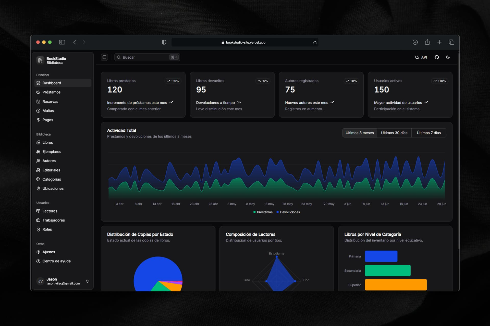

<div align="center">
  
</div>

<div align="center">


</div>

# Bookstudio

Library management system built with Spring Boot, Next.js, and PostgreSQL.

## Repository structure

```
bookstudio/
├── apps/
│   ├── api/                        REST API — Spring Boot 4, Java 17, Maven
│   └── web/                        Frontend — Next.js 16, TypeScript, Tailwind CSS, pnpm
├── apps/api/database/              SQL scripts (schema, functions, triggers, data)
├── package.json                    Root orchestration (concurrently)
├── docker-compose.yml              Base services (postgres + api)
├── docker-compose.override.yml     Dev — web with next dev + hot reload (auto-loaded)
└── docker-compose.prod.yml         Prod — web with next build
```

## Stack

| Layer          | Technology                                                  |
| -------------- | ----------------------------------------------------------- |
| API            | Spring Boot 4, Java 17, Spring Data JPA, Maven              |
| Database       | PostgreSQL 18                                               |
| Frontend       | Next.js 16.1, TypeScript, Tailwind CSS v4, shadcn/ui        |
| File storage   | Configured in system as needed                              |

## Prerequisites

- **Docker Compose v2** to run everything together
- For local dev without Docker: Java 17 JDK, Maven or `./mvnw`, Node.js 20+, pnpm

## Run with Docker Compose

```bash
# 1. Clone the repository
git clone <repo-url> bookstudio && cd bookstudio

# 2. Create the environment file
cp .env.example .env
# Edit .env — at minimum: DB_PASSWORD

# 3. Start all services
pnpm docker:up        # dev mode  — web runs with next dev + hot reload (default)
pnpm docker:up:prod   # prod mode — web built with next build
```

| Service    | URL                                  |
| ---------- | ------------------------------------ |
| PostgreSQL | `localhost:5432`                     |
| API        | `http://localhost:8080`              |
| Web        | `http://localhost:3000`              |
| Swagger UI | `http://localhost:8080/swagger-ui.html` |

Ports are configurable in `.env` via `DB_PORT`, `API_PORT`, `WEB_PORT`.

> **Note:** Scripts in `apps/api/database/` run automatically the first time the PostgreSQL volume is created. To reset the database from scratch: `pnpm docker:down -- -v && pnpm docker:up`.
>
> **Port conflicts:** If any default port is already in use, override it in `.env` — e.g. `DB_PORT=5433`, `API_PORT=8081`, `WEB_PORT=3001`. Internal container communication is unaffected.

## Local development without Docker

### Database

```bash
psql -U postgres -c "CREATE DATABASE bookstudio;"
psql -U postgres -d bookstudio -f apps/api/database/01-schema.sql
psql -U postgres -d bookstudio -f apps/api/database/02-functions.sql
psql -U postgres -d bookstudio -f apps/api/database/03-triggers.sql
psql -U postgres -d bookstudio -f apps/api/database/04-data.sql
```

### Start both services

```bash
pnpm install   # first time only — installs concurrently
pnpm dev       # starts API + Web in parallel
```

Or run each one separately:

```bash
pnpm dev:api   # only API (Spring Boot)
pnpm dev:web   # only Web (Next.js)
```

> **Tip:** If you use the Spring Boot extension in VS Code, the API starts automatically from the editor. In that case, just run `pnpm dev:web`.

### Root scripts

| Script             | Description                        |
| ------------------ | ---------------------------------- |
| `pnpm dev`         | Start API + Web in parallel        |
| `pnpm dev:api`     | Start API only                     |
| `pnpm dev:web`     | Start Web only                     |
| `pnpm web:build`   | Production build (Next.js)         |
| `pnpm web:lint`    | Run ESLint                         |
| `pnpm web:lint:fix`| Run ESLint with auto-fix           |
| `pnpm web:format`  | Format with Prettier               |
| `pnpm docker:up`        | Start all services — dev mode (next dev, hot reload) |
| `pnpm docker:down`      | Stop dev Docker services                             |
| `pnpm docker:up:prod`   | Start all services — prod mode (next build)          |
| `pnpm docker:down:prod` | Stop prod Docker services                            |

### API setup

```bash
cd apps/api

# Set up local properties
cp src/main/resources/application-local.properties.example \
   src/main/resources/application-local.properties
# Fill in your DB credentials, etc.

./mvnw spring-boot:run
# API available at http://localhost:8080
# Swagger UI at http://localhost:8080/swagger-ui.html
```

### Web setup

```bash
cd apps/web
pnpm install
cp .env.example .env.local
# Edit .env.local
pnpm dev
# App available at http://localhost:3000
```

## Environment variables

Configuration depends on how you run the project:

| Approach | Config file |
| -------- | ----------- |
| **Docker Compose** | `.env` (copy from `.env.example`) |
| **Web standalone** | `apps/web/.env.local` (copy from `apps/web/.env.example`) |
| **API standalone** | `apps/api/src/main/resources/application-local.properties` (copy from `.example`) |

The root `.env.example` is only for Docker Compose — if you deploy each service independently (e.g. via Coolify using the individual Dockerfiles), use the per-service config files instead.

### Docker Compose variables

| Variable               | Service       | Description                                             |
| ---------------------- | ------------- | ------------------------------------------------------- |
| `DB_USERNAME`          | postgres, api | Database user                                           |
| `DB_PASSWORD`          | postgres, api | Database password                                       |
| `DB_PORT`              | postgres      | Host port for the DB container (default `5432`)         |
| `API_PORT`             | api           | Host port for the API container (default `8080`)        |
| `WEB_PORT`             | web           | Host port for the Web container (default `3000`)        |
