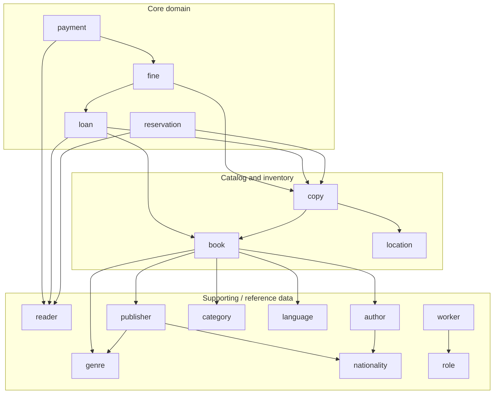

# ADR 0001: Modular monolith with Spring Modulith

- **Status:** Accepted
- **Date:** 2026-10-02

## Context

BookStudio is a single Spring Boot application split into business packages
(`loan`, `copy`, `reader`, `book`, ...). Before this decision those packages were
folders, not boundaries:

- services injected other modules' repositories (`LoanService` used
  `CopyRepository`, `ReaderRepository` and `BookRepository`);
- JPA entities held `@ManyToOne` references to other modules' entities
  (`Loan -> Reader`, `Copy -> Book`, `Fine -> LoanItem`, ...);
- there were dependency cycles (`book <-> copy`, `copy <-> location`).

Any change to an entity could break modules that had no reason to know about
it, and nothing stopped the coupling from growing.

## Decision

Keep one deployable application, but make every top-level package a
**Spring Modulith application module** and enforce the boundaries in the build
(`ModularityTests` runs `ApplicationModules.verify()`).

### Rules

1. **Only a module's root package is public.** Each module that others need
   exposes a small interface there (`ReaderApi`, `CopyApi`, `FineApi`, ...)
   plus the enums that appear in other modules' responses (`CopyStatus`,
   `LoanItemStatus`, `FineStatus`). Everything in `domain`, `application`,
   `infrastructure` and `presentation` is internal.
2. **Reference other aggregates by id.** An entity stores `Long readerId`, never
   `@ManyToOne Reader`. Many-to-many links to other modules are
   `@ElementCollection Set<Long>` on the owning entity (`Book.authorIds`,
   `Payment.fineIds`). Child entities of the same aggregate keep real
   associations (`Loan -> LoanItem`, `Location -> Shelf`).
3. **Writes validate through the other module's API**
   (`readerApi.requireExists(id)`) and change other modules only through
   intention-revealing methods (`fineApi.markPaid(ids)`), never by loading and
   saving their entities.
4. **Reads may join across modules.** List and detail endpoints stay JPQL
   projections to records, using entity joins
   (`JOIN Reader r ON r.id = l.readerId`). This is a deliberate CQRS-light
   trade-off: one database, one query, no N+1, and the read side cannot change
   another module's state.
5. **`shared` is an open module** (shared kernel): API envelopes, errors,
   validation, business code generation.
6. **No cycles.** The resulting graph is a DAG:

### Depth varies by module, the folder layout does not

Every module uses the same `domain / application / infrastructure /
presentation` layout so the codebase reads the same everywhere. How much
design goes inside differs on purpose:

| Module type | Examples | Design |
|-------------|----------|--------|
| Core | `loan`, `fine`, `reservation` | Business rules belong in the entities; cross-module reactions become domain events (next step). |
| Supporting | `language`, `genre`, `category`, `nationality` | Plain CRUD. A service, a repository and projections are enough. |

## Alternatives considered

- **Expose entities with `@NamedInterface`** and only break the cycles. Passes
  `verify()` quickly but keeps the coupling; the tool would just stop
  reporting it.
- **Full hexagonal architecture in every module** (ports, adapters, mappers).
  For reference-data CRUD the extra indirection costs more than it returns.
  Ports are added only where a module has a real external dependency.
- **Microservices.** Same boundaries would be needed first; a modular monolith
  keeps transactions and deployment simple and can be split later along the
  boundaries `verify()` already guarantees.

## Consequences

- Boundaries are checked on every build; a forbidden import fails the tests.
- Some JPQL now joins by id instead of navigating associations, and services
  re-read their list projection after writing instead of mapping entities by
  hand (one source of truth for each response).
- Database foreign keys are unchanged; integrity is still enforced by Postgres.
- Cross-module side effects are synchronous calls inside one transaction for
  now (`payment -> fine`). Moving them to `@ApplicationModuleListener` events
  is the next step for `loan`, `fine` and `reservation`.
