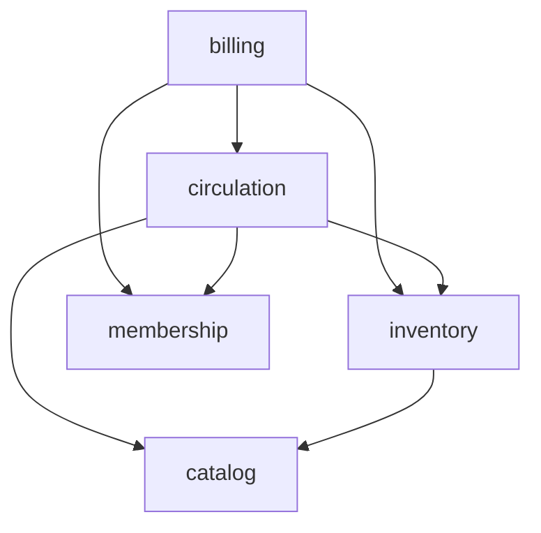

# ADR 0003: Modules follow business capabilities, not tables

- **Status:** Accepted (amends the module list of [ADR 0001](0001-modular-monolith.md))
- **Date:** 2026-10-02

## Context

After ADR 0001 every top-level package was an application module, and there
was one package per table: 17 modules such as `genre`, `language` or
`nationality`. Enforcing their boundaries showed the cost: `book` needed
`GenreApi`, `LanguageApi`, `CategoryApi`, ... just to validate ids of
reference data that only ever changes together with the catalog. Modules that
small describe the database, not the business, and every relation between
two tables became a public API.

## Decision

A module is a **business capability** (a bounded context). Inside it, each
aggregate keeps its own package with the usual layers:

```
com.bookstudio.circulation/          <- module (only this package is public)
├── package-info.java                @ApplicationModule(displayName = "Circulation")
├── LoanApi.java                     public API used by other modules
├── LoanItemStatus.java              public enum shown in other modules' responses
├── loan/                            aggregate (internal)
│   ├── domain/ application/ infrastructure/ presentation/
└── reservation/                     aggregate (internal)
```

| Module | Aggregates | Public API |
|--------|------------|------------|
| `catalog` | book, author, publisher, category, genre, language, nationality | `BookApi` |
| `inventory` | copy, location | `CopyApi`, `CopyStatus` |
| `membership` | reader | `ReaderApi` |
| `circulation` | loan, reservation | `LoanApi`, `LoanItemStatus` |
| `billing` | fine, payment | none |
| `staff` | worker, role | none (basis for authentication) |



Within a module, aggregates may still talk through small internal interfaces
(`catalog.author.AuthorApi`); they are no longer part of any public contract
and can be simplified freely.

### Why these boundaries

- **catalog** vs **inventory**: what a book *is* (bibliographic data) changes
  for different reasons than where a physical copy *is* and whether it is
  available.
- **circulation** is the core domain: lending rules, availability, reservation
  queues.
- **billing** reacts to circulation (late or lost items) but has its own
  lifecycle (pending, paid, waived) and would be the first candidate to split
  out.
- **staff** is identity and permissions for the people who operate the system,
  separate from the library's members (**membership**).

## Consequences

- 6 modules instead of 17; 6 public types instead of 14 public APIs.
- The module graph is a small DAG that is easy to explain and to check in the
  build.
- Moving packages changed no behaviour: every snapshot test passed unchanged.
